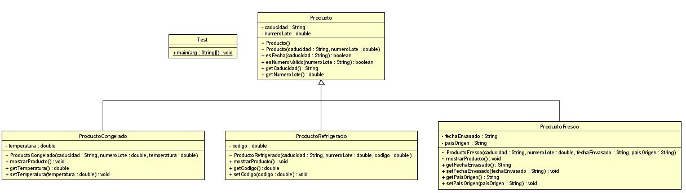

# Ejemplo-Principios-de-Diseño 

## Integrantes
* *Andrés Santiago Ulloa Martínez* - **20192020047**
* *Juan Esteban Torres Acosta* - **20192020052**
* *Nicolas David Gutierrez * - **20172020003**

## Descripción Programa

Este programa consiste en la gestión de una empresa que trabaja con 3 tipos de productos: 

* Productos Frescos
* Productos Refrigerados 
* Productos Congelados

Estos productos contienen esta información en común:

* Fecha de Caducidad
* Numero de Lote

A su vez cada tipo de producto lleva alguna información especifica. Los productos frescos llevan la fecha de envasado y el país de origen, los productos refrigerados deben llevar el código del organismo de supervisión alimentaria y los productos congelados deben llevar la temperatura de congelación recomendada

El objetivo final del programa es que debe, a forma de inventario, mostrar la información de cada uno de los productos que se van registrando en el sistema
## Diseño de paquetes

* Principio de Responsabilidad Única
* KISS
* DRY
* Principio de sustitución de Liskov
* Inversión de dependecias
* Principio abierto y cerrado
## Diagrama de Clases

